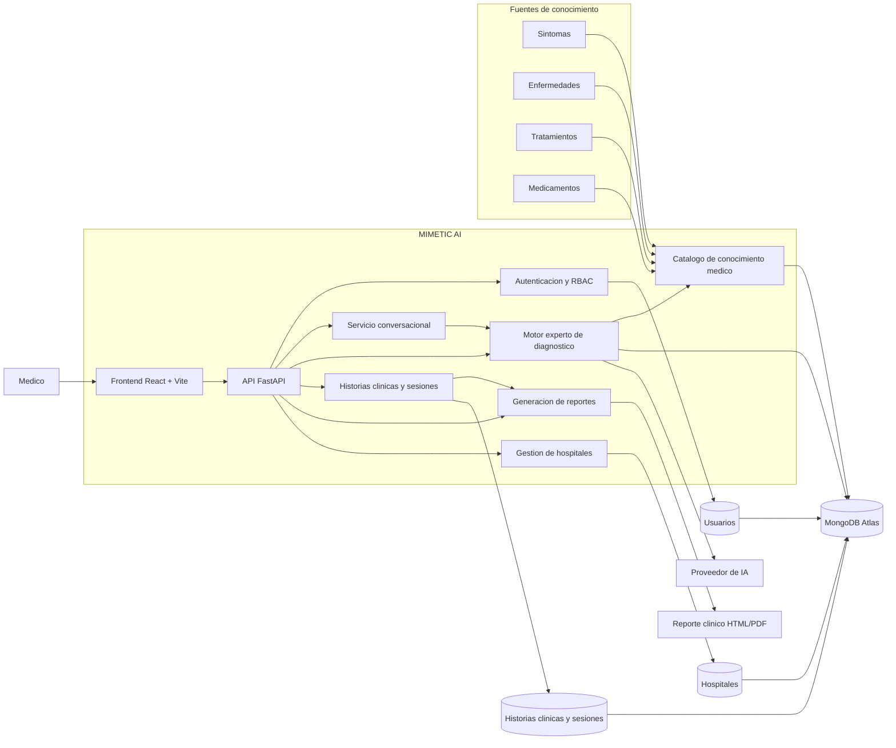

## Diagrama de componentes

```mermaid
flowchart LR
    Medico["Medico"] --> Frontend["Frontend React + Vite"]

    subgraph Aplicacion["MIMETIC AI"]
        Frontend --> API["API FastAPI"]

        API --> Auth["Autenticacion y RBAC"]
        API --> Conversacion["Servicio conversacional"]
        API --> Diagnostico["Motor experto de diagnostico"]
        API --> Historias["Historias clinicas y sesiones"]
        API --> Reportes["Generacion de reportes"]
        API --> Hospitales["Gestion de hospitales"]

        Conversacion --> Diagnostico
        Diagnostico --> Conocimiento["Catalogo de conocimiento medico"]
        Historias --> Reportes
    end

    Auth --> Usuarios[(Usuarios)]
    Hospitales --> HospitalDB[(Hospitales)]
    Historias --> ClinicalDB[(Historias clinicas y sesiones)]
    Conocimiento --> MongoDB[(MongoDB Atlas)]
    Usuarios --> MongoDB
    HospitalDB --> MongoDB
    ClinicalDB --> MongoDB

    Diagnostico --> MongoDB
    Diagnostico --> AI["Proveedor de IA"]
    Reportes --> PDF["Reporte clinico HTML/PDF"]

    subgraph Datos["Fuentes de conocimiento"]
        Sintomas["Sintomas"]
        Enfermedades["Enfermedades"]
        Tratamientos["Tratamientos"]
        Medicamentos["Medicamentos"]
    end

    Sintomas --> Conocimiento
    Enfermedades --> Conocimiento
    Tratamientos --> Conocimiento
    Medicamentos --> Conocimiento
```
