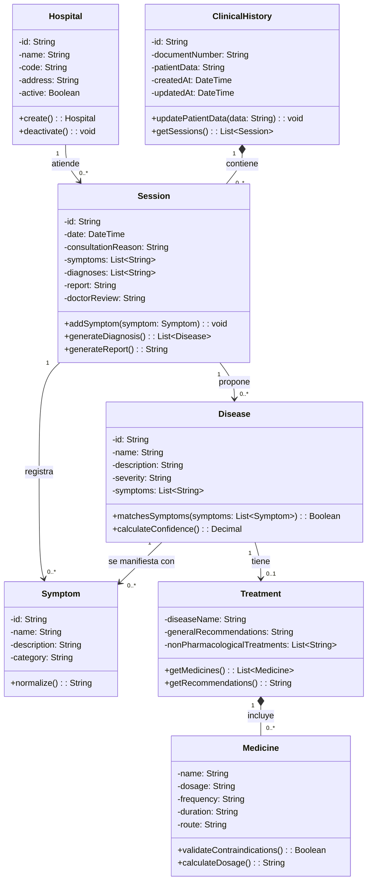
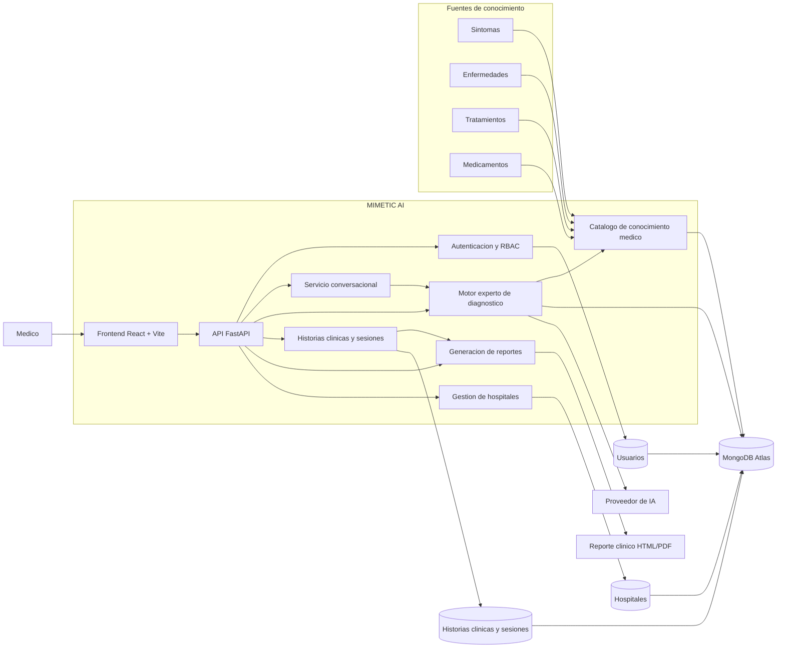

# MIMETIC AI

## Diagrama de clases del nucleo del dominio

```mermaid
classDiagram
    class Hospital {
        -id: String
        -name: String
        -code: String
        -address: String
        -active: Boolean
        +create(): Hospital
        +deactivate(): void
    }

    class ClinicalHistory {
        -id: String
        -documentNumber: String
        -patientData: String
        -createdAt: DateTime
        -updatedAt: DateTime
        +updatePatientData(data: String): void
        +getSessions(): List~Session~
    }

    class Session {
        -id: String
        -date: DateTime
        -consultationReason: String
        -symptoms: List~String~
        -diagnoses: List~String~
        -report: String
        -doctorReview: String
        +addSymptom(symptom: Symptom): void
        +generateDiagnosis(): List~Disease~
        +generateReport(): String
    }

    class Symptom {
        -id: String
        -name: String
        -description: String
        -category: String
        +normalize(): String
    }

    class Disease {
        -id: String
        -name: String
        -description: String
        -severity: String
        -symptoms: List~String~
        +matchesSymptoms(symptoms: List~Symptom~): Boolean
        +calculateConfidence(): Decimal
    }

    class Treatment {
        -diseaseName: String
        -generalRecommendations: String
        -nonPharmacologicalTreatments: List~String~
        +getMedicines(): List~Medicine~
        +getRecommendations(): String
    }

    class Medicine {
        -name: String
        -dosage: String
        -frequency: String
        -duration: String
        -route: String
        +validateContraindications(): Boolean
        +calculateDosage(): String
    }

    Hospital "1" --> "0..*" Session : atiende
    ClinicalHistory "1" *-- "0..*" Session : contiene
    Session "1" --> "0..*" Symptom : registra
    Session "1" --> "0..*" Disease : propone
    Disease "1" --> "0..*" Symptom : se manifiesta con
    Disease "1" --> "0..1" Treatment : tiene
    Treatment "1" *-- "0..*" Medicine : incluye
```

## Diagrama de componentes

```mermaid
flowchart LR
    Medico["Medico"] --> Frontend["Frontend React + Vite"]

    subgraph Aplicacion["MIMETIC AI"]
        Frontend --> API["API FastAPI"]

        API --> Auth["Autenticacion y RBAC"]
        API --> Conversacion["Servicio conversacional"]
        API --> Diagnostico["Motor experto de diagnostico"]
        API --> Historias["Historias clinicas y sesiones"]
        API --> Reportes["Generacion de reportes"]
        API --> Hospitales["Gestion de hospitales"]

        Conversacion --> Diagnostico
        Diagnostico --> Conocimiento["Catalogo de conocimiento medico"]
        Historias --> Reportes
    end

    Auth --> Usuarios[(Usuarios)]
    Hospitales --> HospitalDB[(Hospitales)]
    Historias --> ClinicalDB[(Historias clinicas y sesiones)]
    Conocimiento --> MongoDB[(MongoDB Atlas)]
    Usuarios --> MongoDB
    HospitalDB --> MongoDB
    ClinicalDB --> MongoDB

    Diagnostico --> MongoDB
    Diagnostico --> AI["Proveedor de IA"]
    Reportes --> PDF["Reporte clinico HTML/PDF"]

    subgraph Datos["Fuentes de conocimiento"]
        Sintomas["Sintomas"]
        Enfermedades["Enfermedades"]
        Tratamientos["Tratamientos"]
        Medicamentos["Medicamentos"]
    end

    Sintomas --> Conocimiento
    Enfermedades --> Conocimiento
    Tratamientos --> Conocimiento
    Medicamentos --> Conocimiento
```
