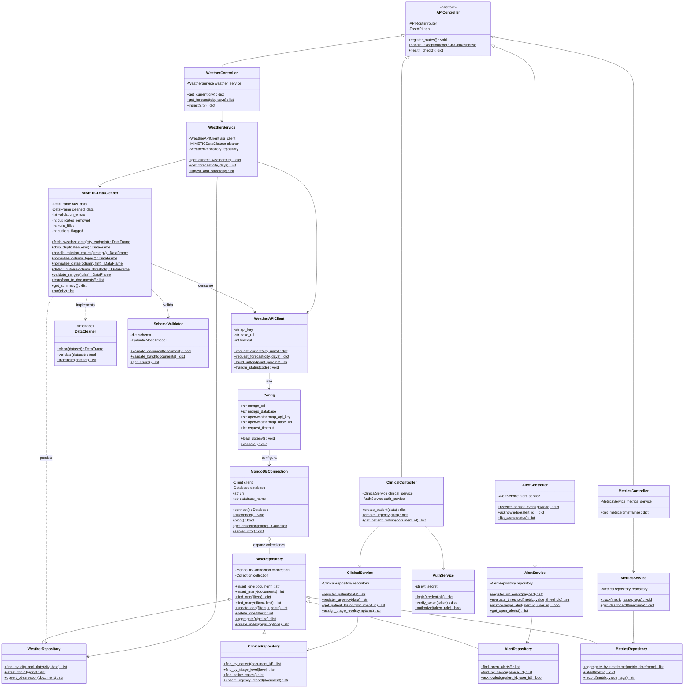

# MIMETIC

## Diagrama de clases - Backend de procesamiento de datos y logica de negocio

**Clases principales:** `MIMETICDataCleaner` (pipeline de limpieza con Pandas), `WeatherAPIClient` (integracion con OpenWeatherMap), la jerarquia `BaseRepository` sobre `MongoDBConnection` (PyMongo) y los controladores REST que exponen los servicios de dominio.