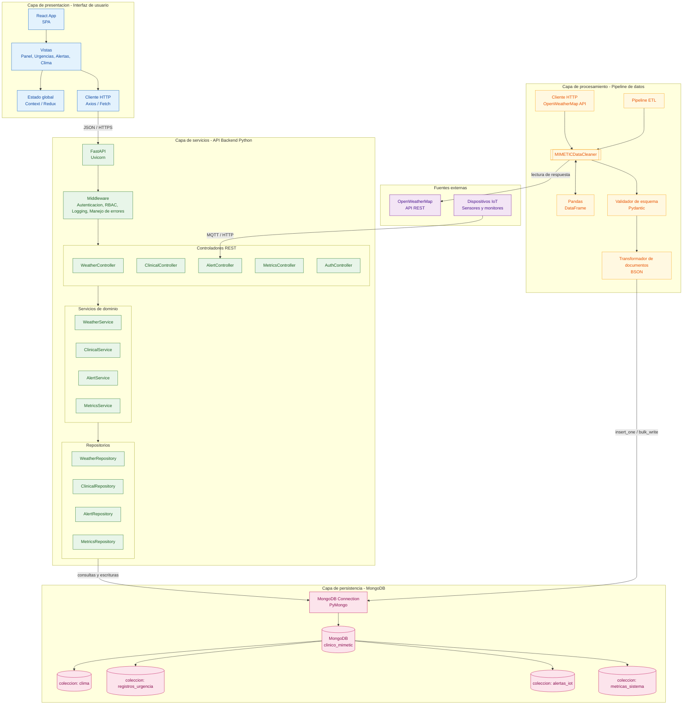

# MIMETIC

## Diagrama de componentes - Arquitectura en capas

**Flujo de extremo a extremo:** React → API FastAPI → Controlador → Servicio → Repositorio → PyMongo → MongoDB.
El pipeline de limpieza se apoya en el pipeline de datos: descarga de OpenWeatherMap → `MIMETICDataCleaner` (Pandas) → validación de esquema → documento BSON → escritura en MongoDB.