# MIMETIC

## Diagrama Entidad-Relacion - Colecciones de MongoDB

```mermaid
erDiagram
    HOSPITAL ||--o{ REGISTRO_URGENCIA : "atiende"
    HOSPITAL ||--o{ SENSOR : "instala"
    HOSPITAL ||--o{ ALERTA_IOT : "recibe"
    HOSPITAL ||--o{ METRICA_SISTEMA : "opera"
    PACIENTE ||--o{ REGISTRO_URGENCIA : "genera"
    SENSOR ||--o{ ALERTA_IOT : "emite"
    REGISTRO_URGENCIA }o--o| CLIMA : "contexto climatico"
    ALERTA_IOT }o--o| REGISTRO_URGENCIA : "asociada a"

    HOSPITAL {
        ObjectId _id PK "Identificador del documento"
        string name "Nombre del hospital"
        string code UK "Codigo institucional"
        string city "Ciudad donde opera"
        string address "Direccion"
        string emergencyPhone "Telefono de urgencias"
        boolean active "Estado activo o inactivo"
        array coverageArea "Zonas geograficas cubiertas"
        date createdAt "Fecha de creacion"
    }

    PACIENTE {
        ObjectId _id PK "Identificador del documento"
        string documentId UK "Documento de identidad"
        string fullName "Nombre completo"
        date birthDate "Fecha de nacimiento"
        string gender "Sexo biologico"
        string bloodType "Grupo sanguineo"
        array allergies "Alergias registradas"
        array comorbidities "Comorbilidades"
        string contactPhone "Telefono de contacto"
        boolean active "Estado activo"
        date createdAt "Fecha de creacion"
    }

    REGISTRO_URGENCIA {
        ObjectId _id PK "Identificador del documento"
        ObjectId hospitalId FK "Hospital que atiende"
        ObjectId patientId FK "Paciente atendido"
        ObjectId climaId FK "Observacion climatica de referencia"
        string caseNumber UK "Numero de caso"
        string triageLevel "Nivel de triaje I a V"
        string admissionReason "Motivo de ingreso"
        array symptoms "Sintomas reportados"
        object vitalSigns "Signos vitales embebidos: FC, FR, TA, SpO2, temperatura"
        string status "Estado: activo, observation, discharge"
        date arrivalTime "Hora de llegada"
        date dischargeTime "Hora de egreso"
        array diagnoses "Diagnosticos registrados"
        string doctorNotes "Notas del medico"
        date createdAt "Fecha de creacion"
        date updatedAt "Ultima actualizacion"
    }

    CLIMA {
        ObjectId _id PK "Identificador del documento"
        string city "Ciudad consultada"
        string country "Pais"
        decimal temperature "Temperatura en grados Celsius"
        decimal feelsLike "Sensacion termica"
        decimal humidity "Humedad relativa"
        decimal pressure "Presion atmosferica"
        decimal windSpeed "Velocidad del viento"
        decimal rainMm "Precipitacion en milimetros"
        decimal clouds "Porcentaje de nubosidad"
        string condition "Descripcion del estado del clima"
        string source "Proveedor: OpenWeatherMap"
        date observedAt "Momento de la observacion"
        date ingestedAt "Momento de la ingesta"
    }

    SENSOR {
        ObjectId _id PK "Identificador del documento"
        ObjectId hospitalId FK "Hospital propietario"
        string deviceId UK "Identificador unico del dispositivo"
        string name "Nombre descriptivo"
        string sensorType "Tipo: temperatura, humedad, gases, ocupacion"
        string location "Ubicacion fisica del sensor"
        string protocol "Protocolo de comunicacion: MQTT, HTTP"
        string status "Estado: online, offline, maintenance"
        decimal lastReading "Ultima lectura registrada"
        date lastSeenAt "Ultima vez que reporto"
        date installedAt "Fecha de instalacion"
    }

    ALERTA_IOT {
        ObjectId _id PK "Identificador del documento"
        ObjectId sensorId FK "Sensor que origino la alerta"
        ObjectId hospitalId FK "Hospital-Esquema"
        ObjectId urgencyId FK "Registro de urgencia asociado"
        string metric "Metrica monitoreada"
        decimal value "Valor medido"
        decimal threshold "Umbral configurado"
        string severity "Criticidad: info, warning, critical"
        string category "Ambiental, climatica, estructural"
        string status "Estado: open, acknowledged, resolved"
        string acknowledgedBy "Usuario que acuso la alerta"
        date acknowledgedAt "Momento del acuse de recibo"
        date detectedAt "Momento de la deteccion"
        date resolvedAt "Momento de la resolucion"
    }

    METRICA_SISTEMA {
        ObjectId _id PK "Identificador del documento"
        ObjectId hospitalId FK "Hospital medido"
        string metricName "Nombre de la metrica"
        decimal value "Valor medido"
        string unit "Unidad de medida"
        string period "Ventana: hourly, daily, monthly"
        string service "Servicio origen: api, iot, report"
        decimal responseTimeMs "Latencia de respuesta en milisegundos"
        decimal errorRate "Tasa de errores"
        decimal uptime "Disponibilidad"
        object tags "Etiquetas libres para segmentacion"
        date recordedAt "Momento del registro"
    }
```

**Colecciones modeladas:** `clinico_mimetic.clima`, `pacientes`, `registros_urgencia`, `sensores`, `alertas_iot` y `metricas_sistema`. Los documentos siguen el estilo de MongoDB: identificador `ObjectId`, datos relacionales como referencias (`FK`) y datos derivados embebidos en el mismo documento (`vitalSigns`, `tags`).