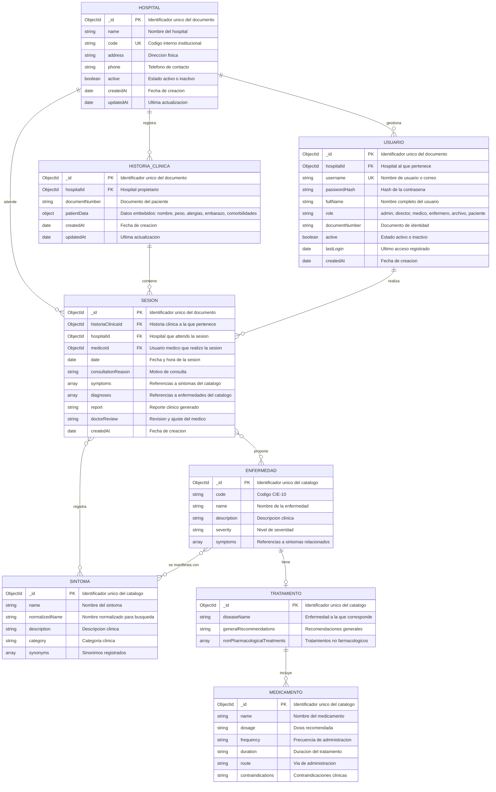

# MIMETIC AI

## Modelo de base de datos (MongoDB) - Diagrama Entidad-Relacion

```mermaid
erDiagram
    HOSPITAL ||--o{ USUARIO : "gestiona"
    HOSPITAL ||--o{ HISTORIA_CLINICA : "registra"
    HOSPITAL ||--o{ SESION : "atiende"
    HISTORIA_CLINICA ||--o{ SESION : "contiene"
    USUARIO ||--o{ SESION : "realiza"
    SESION }o--o{ SINTOMA : "registra"
    SESION }o--o{ ENFERMEDAD : "propone"
    ENFERMEDAD }o--o{ SINTOMA : "se manifiesta con"
    ENFERMEDAD ||--o| TRATAMIENTO : "tiene"
    TRATAMIENTO ||--o{ MEDICAMENTO : "incluye"

    HOSPITAL {
        ObjectId _id PK "Identificador unico del documento"
        string name "Nombre del hospital"
        string code UK "Codigo interno institucional"
        string address "Direccion fisica"
        string phone "Telefono de contacto"
        boolean active "Estado activo o inactivo"
        date createdAt "Fecha de creacion"
        date updatedAt "Ultima actualizacion"
    }

    USUARIO {
        ObjectId _id PK "Identificador unico del documento"
        ObjectId hospitalId FK "Hospital al que pertenece"
        string username UK "Nombre de usuario o correo"
        string passwordHash "Hash de la contrasena"
        string fullName "Nombre completo del usuario"
        string role "admin, director, medico, enfermero, archivo, paciente"
        string documentNumber "Documento de identidad"
        boolean active "Estado activo o inactivo"
        date lastLogin "Ultimo acceso registrado"
        date createdAt "Fecha de creacion"
    }

    HISTORIA_CLINICA {
        ObjectId _id PK "Identificador unico del documento"
        ObjectId hospitalId FK "Hospital propietario"
        string documentNumber "Documento del paciente"
        object patientData "Datos embebidos: nombre, peso, alergias, embarazo, comorbilidades"
        date createdAt "Fecha de creacion"
        date updatedAt "Ultima actualizacion"
    }

    SESION {
        ObjectId _id PK "Identificador unico del documento"
        ObjectId historiaClinicaId FK "Historia clinica a la que pertenece"
        ObjectId hospitalId FK "Hospital que attends la sesion"
        ObjectId medicoId FK "Usuario medico que realizo la sesion"
        date date "Fecha y hora de la sesion"
        string consultationReason "Motivo de consulta"
        array symptoms "Referencias a sintomas del catalogo"
        array diagnoses "Referencias a enfermedades del catalogo"
        string report "Reporte clinico generado"
        string doctorReview "Revision y ajuste del medico"
        date createdAt "Fecha de creacion"
    }

    SINTOMA {
        ObjectId _id PK "Identificador unico del catalogo"
        string name "Nombre del sintoma"
        string normalizedName "Nombre normalizado para busqueda"
        string description "Descripcion clinica"
        string category "Categoria clinica"
        array synonyms "Sinonimos registrados"
    }

    ENFERMEDAD {
        ObjectId _id PK "Identificador unico del catalogo"
        string code "Codigo CIE-10"
        string name "Nombre de la enfermedad"
        string description "Descripcion clinica"
        string severity "Nivel de severidad"
        array symptoms "Referencias a sintomas relacionados"
    }

    TRATAMIENTO {
        ObjectId _id PK "Identificador unico del catalogo"
        string diseaseName "Enfermedad a la que corresponde"
        string generalRecommendations "Recomendaciones generales"
        array nonPharmacologicalTreatments "Tratamientos no farmacologicos"
    }

    MEDICAMENTO {
        ObjectId _id PK "Identificador unico del catalogo"
        string name "Nombre del medicamento"
        string dosage "Dosis recomendada"
        string frequency "Frecuencia de administracion"
        string duration "Duracion del tratamiento"
        string route "Via de administracion"
        string contraindications "Contraindicaciones clinicas"
    }
```